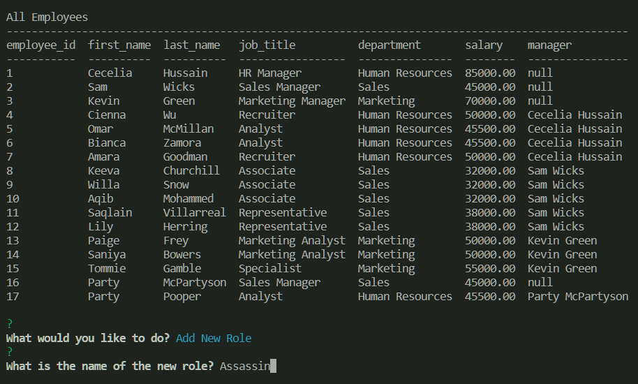
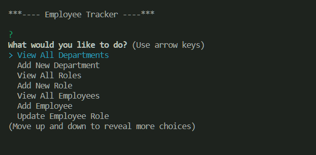

  # Employee Tracker
  
  

  ## Table of Contents
  * [Description](#description)
  * [Installation](#installation)
  * [Usage](#usage)
  * [License](#license)
  * [Contributing](#contributing)
  * [Tests](#tests)
  * [Questions](#questions)

  ## Description

  Manage your Employees, Roles, and Departments in a simple console program.
  ## Installation

  Follow the below steps to install the program:

    npm i

  ## Usage

  

  To use the Employee Tracker, simply enter the following command into your console after installation is complete:
        
    node server.js

Once the server is running, you can use your keyboard to select options from the provided list.

You can also see a video demonstration of the app in action [HERE!](https://watch.screencastify.com/v/Yi4phdGupSgKVqWU0NKJ)

  ## Questions

  For more information, feel free to contact me:

  GitHub: [github.com/stevengoldbergm](https://github.com/stevengoldbergm)
  